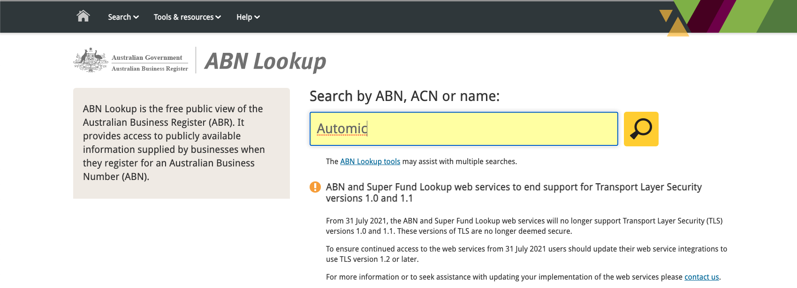
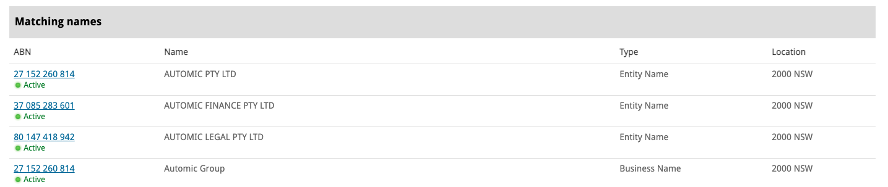
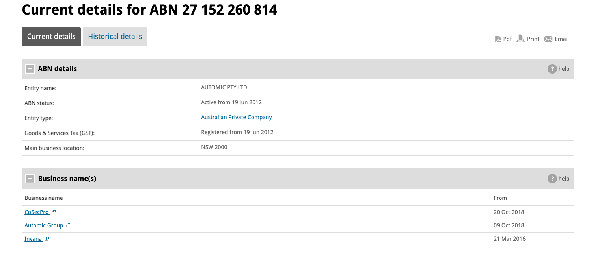
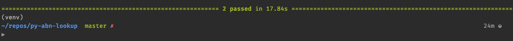
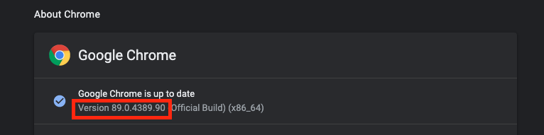
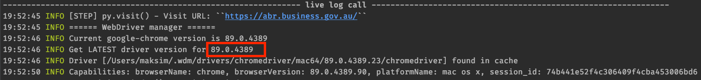

# ABN Lookup: Automated Web UI Tests

> This repository contains examples of  automated  web UI tests  built using Selenium, Python and Pyleniumio 

**Tests :**

- **TC-1** 

  - Steps:
    - Open browser and navigate to https://abr.business.gov.au/
    - Type" Automic" in the lookup field

  - Expected:
    - The search results shall contain
    - 


- TC-2

  - Steps:

    - Execute TC-1

    - Click on link “27 152 260 814”

      

  - Expected:

    - ABN details should contain
    - 


## Installation

Installation includes the following steps:

1. Clone repo.

2. Create virtual environment.

3. Activate virtual environment.

4. Install dependencies  from requirements.txt


Dependencies include:

- python3
- pip
- virtualenv (or alternative tool)


Please find below more details on how to install repo.


### Clone repo

- Clone this repo to your local machine using 

```shell
▶ git clone https://github.com/MaksimZinovev/py-abn-lookup.git
```


### Create virtual environment

Assuming you  already have **python3** installed on your machine.

```
▶ cd py-abn-lookup
```


MacOS (virtualenv):

```shell
▶ virtualenv venv
```


MacOS (venv):

```shell
▶ python3 -m venv "venv"
```


Windows (venv):

```shell
▶ python -m venv "venv"
```


### Activate virtual environment

MacOS

```shell
▶ source venv/bin/activate
```


Wndows - please refer to [python docs](https://docs.python.org/3/library/venv.html)

```shell
 venv\Scripts\activate.bat
```


### Install dependencies  from requirements.txt

```shell
▶ pip install -r requirements.txt
▶ pylenium --version
```


## Install driver


Pylenium installs these for you automatically! YOU DO NOT NEED TO DO THIS!

For more details, please visit [Pyleniumio docs](https://elsnoman.gitbook.io/pylenium/misc/install-chromedriver).


## Running the tests

Run all tests

```
▶ pytest tests   
```


Headless tests

```shell
# Headless tests
pytest tests --options="headless, disable-gpu, no-sandbox"
```


Run the tests using Chrome.

You can configure which browser to use for tests in two ways: using pylenium.json or directly from terminal. 

Pylenium.json is located in the root folder of the repo.

```json
# pylenium.json
"driver": {
    "browser": "chrome",
    "remote_url": "",
    "wait_time": 10,
    "page_load_wait_time": 0,
    "options": [],
    "experimental_options": null,
    "capabilities": {},
    "extension_paths": [],
    "version": "latest"
  }

```


Configuring browser from terminal. This is the browser name - "chrome" or "firefox" or "ie" or "opera" or "edge". For example, running tests using Chrome

```shell
pytest tests --browser=chrome
```





For more configuration info, please read [Pyleniumio docs.](https://elsnoman.gitbook.io/pylenium/)


## FAQ

- **I am getting the error related to driver**
  
    - Please check your browser version. Browser version should match driver version. 
    - Update your browser if necessary or specify which driver version you want to use in pylenium.json.
    - For more info please visit [Pyleniumio docs.](https://elsnoman.gitbook.io/pylenium/)
    
    
    
    
    &nbsp;
    
- **I am on Windows and getting error while runningthe tests.**

    - if you have python 3.9 try to use python 3.8 instead.


## License

[](http://badges.mit-license.org)

- **[MIT license](http://opensource.org/licenses/mit-license.php)**
- Author: [Maksim Zinovev](https://github.com/MaksimZinovev) 

